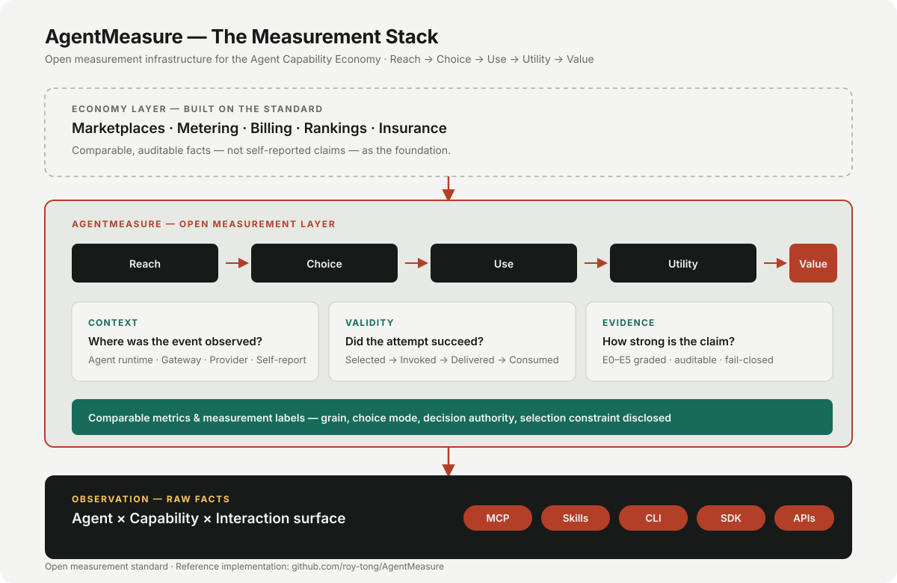

# AgentMeasure

**Agent 经济缺一把公尺——AI 用了什么、干得怎么样，行业还没有统一的算法。**
**度量 Agent 的真实使用——别把重试当成用户。**

[](https://github.com/roy-tong/AgentMeasure/actions/workflows/conformance.yml)
[](standard/CORE.md)
[](https://github.com/roy-tong/AgentMeasure/releases)
[](LICENSE)
[](https://github.com/roy-tong/AgentMeasure/discussions)

> **AgentMeasure 把执行事实与逻辑操作分开、把证据与推断分开、把经济结算与价值分开**
> ——一套面向 Agent Capability Economy 的开放计量层。给仪表盘一个可用的数字
> （逻辑操作数），给每个数字可审计的证据，给测不到的部分明确的披露，
> 而不是一个装作精确的估计。

**今天：** 度量 Agent 对软件能力的使用——attempts、operations、retry 膨胀、
分子可审计的成功率。
**下一步：** 让 Capability 可以跨 Agent 被统一度量、比较和计量——包括正在被
计费的"效果单位"（什么算一次解决、一次完成的任务）。
**长期：** 成为 Capability as a Service（CaaS）的计量基础。

**Reach → Choice → Use → Utility → Value**

> AgentMeasure **不是**支付协议、市场或通用排名系统。
> 它标准化的是这些系统可以构建于其上的事实与测量语义。

## 为什么是现在

AI 服务已经开始按效果收钱：Zendesk 2024 年 8 月起[按"解决一单"收 1.50–2.00 美金](https://www.zendesk.com/newsroom/articles/zendesk-outcome-based-pricing/)，[Intercom Fin 一单 0.99 美金](https://www.intercom.com/pricing/fin)还带退款保证，[Sierra 按效果签企业合同](https://sierra.ai/blog/outcome-based-pricing-for-ai-agents)。但**"什么算一次解决"没有标准**——重试、工单重开、"客户沉默就算已解决"，都改着这个数，也改着账单。钱挂在一个可测量的量上，就得有人把这个量定义清楚。这就是我们在做的事。→ [读这篇说明](https://roy-tong.github.io/AgentMeasure/blog/outcome-yardstick.html)

## 我们的原则（先写下来，免得以后被要求破例）

- **永久免费。** 规范、引擎、SDK、conformance、本地看板——免费清单写进治理，不秋后算账。用起来，就是产品。
- **本地优先，opt-in 才回流。** 原始数据默认不出你的机器；只有聚合、匿名后的证据回流网络，而且要你自己选择加入。
- **裁判不开店。** 不卖排名、不卖推荐位、不碰钱。中立就是产品。

[**官网**](https://roy-tong.github.io/AgentMeasure/) · [**发送一段 trace，换一份 measurement check**](mailto:tongroy18@gmail.com?subject=AgentMeasure%20measurement%20check%20-%20%5Byour%20capability%5D&body=Hi%2C%0A%0AI%27d%20like%20a%20zero-install%20measurement%20check.%0A%0A1.%20Data%3A%2020-100%20anonymized%20trace/log%20rows%2C%20or%20a%20link%20to%20a%20public%20export%20%28production%20or%20synthetic%20-%20please%20say%20which%29%3A%0A%0A2.%20Source%20and%20time%20window%3A%0A%0A3.%20The%20decision%20this%20should%20inform%3A%0A%0ANote%3A%20raw%20data%20stays%20local%20by%20default.%20If%20I%20share%20a%20sanitized%20sample%2C%20I%27ll%20state%20what%20may%20be%20done%20with%20it.)（零安装：20–100 行匿名数据；未经你明确授权不出你的机器） · [免费 7 天 Audit——申请](https://github.com/roy-tong/AgentMeasure/issues/new?template=5-provider-trial.yml) · [Whitepaper](whitepaper/measuring-software-used-by-ai-agents.md) · [中文白皮书](whitepaper/measuring-software-used-by-ai-agents.zh-CN.md) · [Core Specification](standard/CORE.md) · [English](README.md)



**从这里开始读故事：** [当软件的消费者变成 Agent](https://roy-tong.github.io/notes/when-the-software-consumer-becomes-an-agent/)（中文）· [When the Software Consumer Becomes an Agent](https://roy-tong.github.io/en/notes/when-the-software-consumer-becomes-an-agent/)（EN）

## 2 分钟上手

```bash
./examples/demo-e2e.sh
```

Mock MCP server → canonical observations → 本地指标，全程本机运行、无云依赖。
Demo 可复现：每次运行使用隔离 workspace（不触碰 `~/.agentmeasure`）——相同
fixture + 相同 policy = 相同结果（42 calls → 84 observations）。

再看看我们如何审计生态的 usage 声称：[Benchmark Run #001](reports/benchmark-run-001.md)——
六个真实声称按多轴 Evidence Profile 出具标签（无综合评分）；我们自己的数字
（[Pipeline Validation #001](reports/pipeline-validation-001.md)）只作参考基线，
不参与排名。

---

## 跑一个预注册实验 — AgentMeasure Lab

```bash
python3 lab/am lab selftest                                   # 植入提升被检出 + 诚实 null
python3 lab/am lab init                                       # 工作区 + 示例实验
python3 lab/am lab preregister am-lab/experiments/example-manifest.json
python3 lab/am lab run am-lab/experiments/example-manifest.prereg.json
```

开放实验引擎（[lab/](lab/README.md)）：任务集 × Harness 矩阵 × 因子变体 →
Reach → Choice → Success → Consumption 漏斗 → 带置信区间的效应量、guardrail、
诚实的 null、以及以**双语决策人一页版**开篇的本地 HTML 报告。预注册被强制执行
（假设 / 主指标 / guardrail / 分析计划运行前哈希锁定，并附规模/功效/预算预估），
种子确定性重放，预算熔断安全停止并保留已采数据。选择率提升而消费率下跌的方案
会在**决策出口被拒绝**（`unverified_growth`——不上线）；不带来更多钱却更贵的
候选会被标注"被支配"。

内置示例运行在**合成 Harness** 上（按文献口径的现实幅度植入 ground truth，
每份报告显式披露）——它验证的是引擎，不是对真实 Agent 的主张。真实 Harness
适配器（Claude Code / Codex）是同一接口上的 runner 插件，这是当前最有价值的
贡献方向。文档：[lab/README.md](lab/README.md) · 格式：
[lab/schemas/](lab/schemas/)（实验 manifest / 漏斗事件 / 报告）。

---

## 为什么 Capability 需要新的测量层

软件消费者正在从人变成 Agent，经济单元正在从软件席位转向可调用的能力（callable capabilities）。

```text
Skill / MCP / CLI / SDK
        ↓
描述 / 暴露 / 分发一个 capability

Capability
        ↓
数据 / 算力 / 动作 / 权限 / 交易
        ↓
创造稀缺经济价值
```

**接口可能变得廉价易造；能力依然是稀缺的交付物。**

第一代能力分发已经到来——开放的 Skill、开放的 MCP adapter、开放的 CLI。它们底下的稀缺层才是下一个经济体的基石：专有数据、算力、执行、权限与真实世界的履约。

## 从软件经济到 Capability Economy

```text
人的软件经济
用户 → UI → SaaS → 席位 / 月

             ↓

Agent Capability Economy
Agent → Capability → 执行 → 结果
                       ↓
              使用 / 价值 / 交易
```

如果 Capability 要成为 Agent 可以自动发现、比较、最终自动采购的经济单元，它必须先能被**统一地识别、度量和比较**。这正是 AgentMeasure 提供的。

传统使用指标支撑不了这个经济体——旧链路每一环都在断裂，而最后一环是新的：

```text
安装 ≠ 可用
可用 ≠ 被呈现
被呈现 ≠ 被选择
被选择 ≠ 被使用
被使用 ≠ 有用
有用 ≠ 增量价值
被度量的使用 ≠ 可计费的使用
```

最后一个不等式正是 Operation/Attempt 模型的商业意义：一次 Operation 的 3 次
Attempt ≠ 3 次可计费操作——除非计量策略如此规定。

> 完整论点——经济单元、稀缺性、先计量后变现、计量语义，以及"商业先于计量到来"
> 的证据——见 [docs/CAPABILITY-ECONOMY.md](docs/CAPABILITY-ECONOMY.md)。

## Measurement View：Reach → Choice → Use → Utility → Value

AgentMeasure 定义 **Metric Families**，不定义全局北极星。搜索能力、预订 API、计算任务的价值结构各不相同。

| 层 | 回答 | 代表指标 |
| --- | --- | --- |
| **Reach** | 能力有没有进入 Agent 的选择范围？ | Eligible Opportunities · Presentations · Presentation Rate · Distribution Coverage |
| **Choice** | Agent 有机会时会选它吗？ | Observed Selection Rate · Observed Head-to-Head Choice Share |
| **Use** | 选了以后真的用了吗？ | Operations · Attempts · Completion Rate · Success Rate |
| **Utility** | 产生了可用结果或确认的效应吗？ | Result Consumption · Effect Confirmation |
| **Value** | 改善任务结果了吗？ | Incremental Task Success（Draft 0.5） |

五层是**测量视角**。同一批事实也映射到经济视角：

| CaaS 域 | AgentMeasure |
| --- | --- |
| Demand（需求） | Reach + Choice |
| Delivery（交付） | Use + Utility |
| Outcome（结果） | Value |
| Economics（经济） | Metering / Attribution（未来扩展） |

全程保持声称纪律：*observed choice ≠ preference*。选择可能由模型、路由、工作流、
用户、策略或平台作出；**Observed Selection Rate** 只报告观测到的选择，而
**Observed Head-to-Head Choice Share** 是*可比候选条件下观测到的正面竞争选择份额*——可比
意味着声明相同的候选集、类别、Choice Mode 与决策轴（Decision Authority /
Selection Constraint）。

## AgentMeasure 在生产中如何工作

```text
Agent Runtime                     Capability Provider

Claude / Codex
      │
      │ MCP / API
      ▼
                         ┌──────────────────────┐
                         │ 客户自有 Capability  │
                         │                      │
                         │ AgentMeasure SDK     │
                         │ Business Handler     │
                         └──────────┬───────────┘
                                    │
                                observations
                                    │
                                    ▼
                              Collector
                                    │
                                    ▼
                            AgentMeasure Cloud
```

真实开发者最关心的四句话：

> 你的软件**不需要**开源。
>
> MCP **不是必须的**——它只是第一个参考 surface。
>
> 第三方 Agent **不需要**安装 AgentMeasure 也能在 Provider 侧度量使用。
>
> AgentMeasure **不在请求关键路径上**。

产品架构（Provider SDK → 本地缓冲 → 托管 ingestion → 面板）：
[product/ARCHITECTURE.md](product/ARCHITECTURE.md)。

## 今天测量什么

- **Decision Opportunity / Candidate Set / Presentation / Selection** —— 选择的四个对象；Observed Selection Rate 的分母是 Presented，不是 Available
- **Software Entity → Capability → Interaction Surface** —— 存在什么、能做什么、怎么交互；观察发生在 surface 层，归属经机器可读 registry 解析到 entity
- **Operation / Attempt** —— 一次逻辑使用 vs 一次执行；**重试 = 同一 Operation 的多个 Attempt，不再是 validity 分类**（作为可靠性信号保留，不当作多次逻辑使用计数）
- **Qualified Usage** —— 按策略排除 test / benchmark / synthetic / replay / duplicate 等无效流量后的生产使用
- **Result Consumption** —— *已定义，参考实现部分*：结果被任务使用
- **Effect Confirmation** —— *领域模型已定义，指标计划于 Draft 0.5*：预期的世界状态改变被确认
- **Measurement Label** —— 每个公开数字的营养成分表（覆盖 / 采样 / 口径 / 方法）

完整模型见 [Core Specification](standard/CORE.md) / [Metrics](standard/METRICS.md) /
[Entity](standard/ENTITY.md) / [Quality](standard/QUALITY.md)。README 不是 spec 摘要。

## 从 Measurement 到 CaaS

AgentMeasure 正在**渐进标准化**从发现与选择、经执行到效用与价值的测量链：核心使用
语义今天已定义；效用/价值与商业计量仍是活跃草案。计量与商业归因是未来扩展；支付
轨道可以由现有支付基础设施提供。

> **AgentMeasure 标准化经济事实，不移动金钱。**
>
> 完整论点：[docs/CAPABILITY-ECONOMY.md](docs/CAPABILITY-ECONOMY.md) ·
> 经济语义：[extensions/COMMERCIAL.md](extensions/COMMERCIAL.md)（Experimental）

## AgentMeasure 是 / 不是

| AgentMeasure 是 | AgentMeasure 不是 |
| --- | --- |
| 测量标准 | 支付协议 |
| 使用分析的基础设施 | 市场 / Marketplace |
| 计量语义 | 钱包 |
| 可比较的质量信号 | 通用声誉分 |
| 归因框架 | 唯一真相来源 |

## Harness Profiles——每个运行时能（与不能）观察到什么

可移植的测量语义，需要对观察盲区的公开记录。每份 profile 把运行时原生对象
映射到 AgentMeasure 语义对象：

| Harness | Profile | 要点 |
| --- | --- | --- |
| Codex | [profiles/codex.md](profiles/codex.md) | hook 观察，无 trace/精确时间戳；App Server 事件流为优先生效观察面 |
| Claude Code | [profiles/claude-code.md](profiles/claude-code.md) | 内置成败判定；第一个 Consumption 可实证平台 |
| DeepSeek Harness | [profiles/deepseek-harness.md](profiles/deepseek-harness.md) | append-only session log；subagent lineage/depth 是 Delegation 的首个真实数据源 |
| Pydantic AI | [profiles/pydantic-ai.md](profiles/pydantic-ai.md) | Logfire span → attempt 语义 |
| OpenTelemetry GenAI | [profiles/opentelemetry-genai.md](profiles/opentelemetry-genai.md) | Route B 映射 |

当 Harness 在运行时组合软件，同一行为会在不同运行时中被不同对象和单位描述。
[实验 D](experiments/EXPERIMENT-D-cross-harness-compatibility.md) 把这件事变成
证据；[提案：Delegation](proposals/2026-08-21-delegation-graph.md) 定义对象模型
此前缺失的 Agent 调 Agent 委托边界。

## 给谁用

| 受众 | 为什么 |
| --- | --- |
| **Capability Provider** | 度量并最终计量 Agent 对你能力的使用 |
| **Agent Runtime** | 一致地暴露决策 / 使用信号 |
| **Registry / Marketplace** | 用标准化信号比较能力 |
| **数据 / 测量服务商** | 产出可比较的 Agent 使用分析 |
| **商业 / 支付基础设施** | 在未来 profile 中消费标准化计费事件 |
| **研究者 / 标准贡献者** | 演进方法论 |

## 试用标准

```bash
git clone https://github.com/roy-tong/AgentMeasure && cd AgentMeasure
python3 conformance/runners/run_metrics.py   # 指标 vectors（M2.2 / M2.5 / M4.1）
python3 verify_vectors.py                     # verification / correlation / operation vectors
python3 registry/validate_entities.py         # 校验机器可读 registry
```

## 产品 MVP —— 第一次真实测量（开发中）

第一条产品路径是 **Remote MCP / API Capability Measurement**：[AgentMeasure Provider
SDK](sdk/)（`@agentmeasure/mcp`）在 Provider 侧产出 observations（无需 Agent 侧
安装），接入本地 collector。本地分析无需任何云：

```bash
npm install https://github.com/roy-tong/AgentMeasure/releases/download/v0.1.1/agentmeasure-mcp-0.1.1.tgz
# (npm 正式发布等待 scope/token —— 当前安装路径为 release tarball)
# 包装你的 MCP server 的 tool handler：server.tool = (name, schema, mw.wrapTool(name, handler))
node examples/mcp-integration.js          # 合成流量 → 本地 JSONL
python3 product/local-analytics.py ~/.agentmeasure/events/agentmeasure-events.jsonl
```

状态：SDK v0.1.1 — External-Ready（canonical 输出、非阻塞 spool + 丢失记账、
per-request caller、MCP v1/v2、21 测试、确定性 fixture）+ 本地分析已实现；
托管 ingestion 与面板下一步。第一个真实外部 Provider
= Product Gate A（[ROADMAP.md](ROADMAP.md)、[MVP.md](product/MVP.md)）。

范围与验收：[product/MVP.md](product/MVP.md) · SDK 契约：
[product/PROVIDER-SDK.md](product/PROVIDER-SDK.md) · 部署：
[product/DEPLOYMENT.md](product/DEPLOYMENT.md)

## 仓库结构

```text
AgentMeasure/
├── standard/          # 规范性标准本体（CORE / METRICS / QUALITY / DATA / ...）
├── extensions/        # 实验性、非规范性 profile（COMMERCIAL.md）
├── product/           # 产品架构（SDK / 托管分析，in development）
├── whitepaper/        # 方法论论文（中英）
├── conformance/       # 语言无关 test vectors + runners
├── reference/         # 参考实现（collector + adapters）
│   ├── collector/     #   归一、关联、聚合、证据
│   └── adapters/      #   codex / claude / dsh / mcp 观察适配
├── schemas/           # 机器可读 schema（entity registry）
├── registry/          # 机器可读注册表（entities / project identity）
├── experiments/       # 三类实证实验设计
├── reports/           # 公开报告（Discrepancy Report）
├── proposals/         # 指标与规范变更提案（AUP）
└── archive/           # 已废弃的早期文档
```

**标准是本体；代码是参考实现。** 使用标准不意味着向任何中心服务器上传数据。

## 状态与路线图

**Draft 0.4.3（Canonicalization & Reference Convergence）** —— 唯一 Canonical
Observation（schemas/observation.schema.json，6 类 payload）；Choice/Execution 从同一
Envelope 派生；M3.1 只计已解析 operation（无回退）；Attempt 级 qualification 派生；
metrics.yaml 单一事实源；四维正交（Evidence/Caller/Use Profile/Billing）。

| 能力 | 标准 | 参考实现 | 真实运行 |
| --- | --- | --- | --- |
| Observed Selection Rate | Defined | Implemented | Limited |
| Observed Head-to-Head Choice Share | Defined | Implemented | Experimental |
| Operations / Attempts | Defined | Implemented | Yes |
| Operation Resolution Coverage | Defined | Implemented | No |
| Result Consumption | Defined | Implemented | Claude partial |
| Incrementality | Defined (formula) | Planned | No |
| Qualified Usage (Strict) | Defined | Implemented | Yes |

路线图双轨运行——标准轨（0.4 对象与质量 → 0.5 效用与经济语义 → 1.0）与产品轨
（Remote Capability Analytics → Provider SDK + 托管分析 → Metering）。见
[ROADMAP.md](ROADMAP.md)。

## 参与

- **加入社区**：[Discussions](https://github.com/roy-tong/AgentMeasure/discussions) —— 分类：Metric Semantics · Runtime Observation · Experiments · Capability Economy · Implementers；讨论守则见 [docs/DISCUSSIONS.md](docs/DISCUSSIONS.md)
- **提标准变更**：`proposals/`（AUP：Draft → Discussion → Accepted → Experimental → Stable）
- **报告测量偏差**：`reports/`（Discrepancy Report 模板）
- **修参考实现**：PR 必须通过 `conformance/` 全部 vectors

---

*AgentMeasure 不定义谁是真相来源，而定义什么证据、按照什么规则，可以支持什么结论。*
